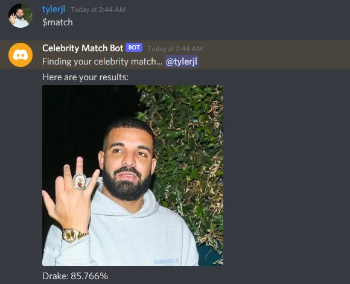

# Celebrity Matcher Discord Bot

The Celebrity Matcher Discord Bot is a bot that when called will take the users profile picture and return the top 5 closest matches to celebrities.

To activate the bot, the user types "$match" in the text channel.

Example shown here:

If you want to add the bot to your server the link is here:

https://discord.com/api/oauth2/authorize?client_id=854450166995746866&permissions=518208&scope=bot

## Dependencies

The Bot is currently configured to run on a heroku instance using their free python dynamo with the following dependencies:

- discord
- mtcnn
- keras_applications
- keras_vggface
- tensorflow-cpu
- pillow
- opencv-python-headless
